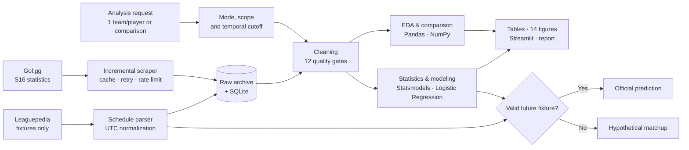
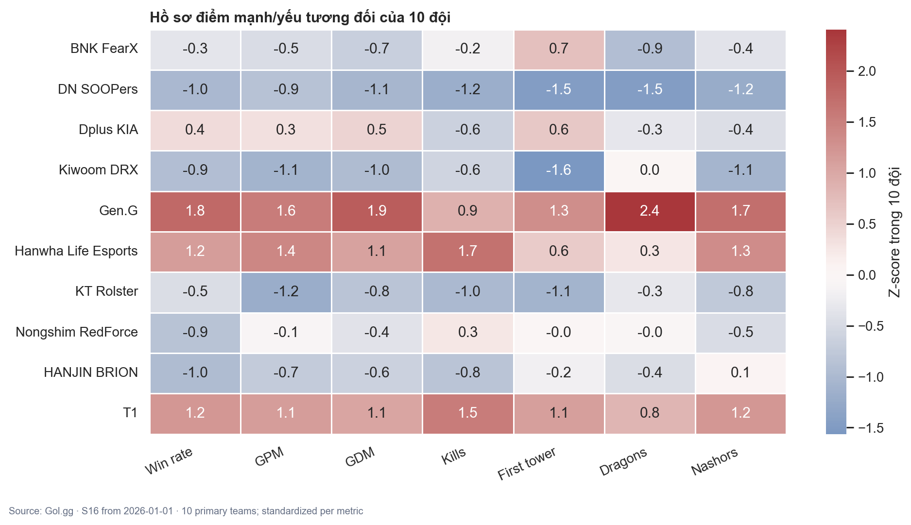
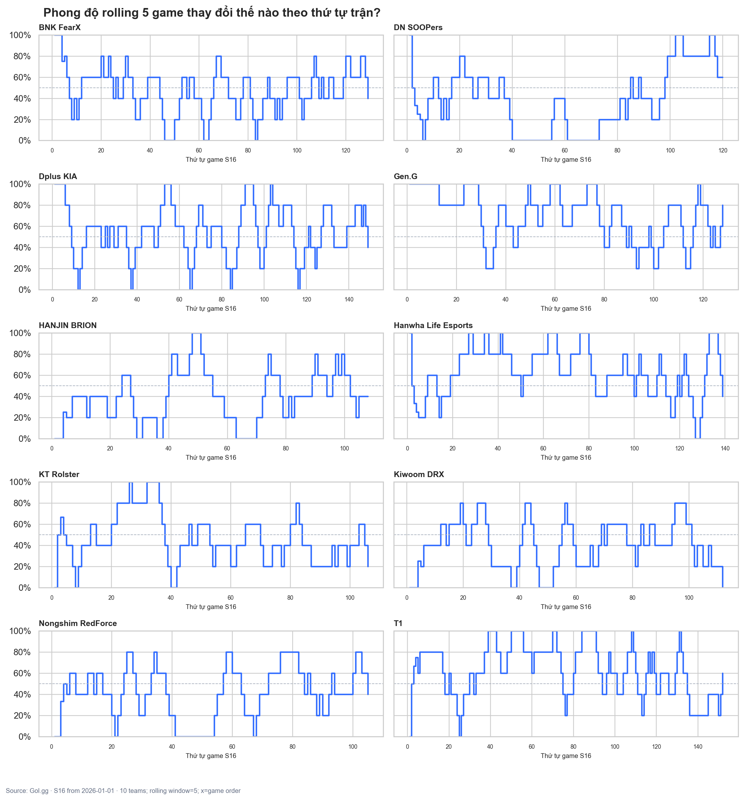
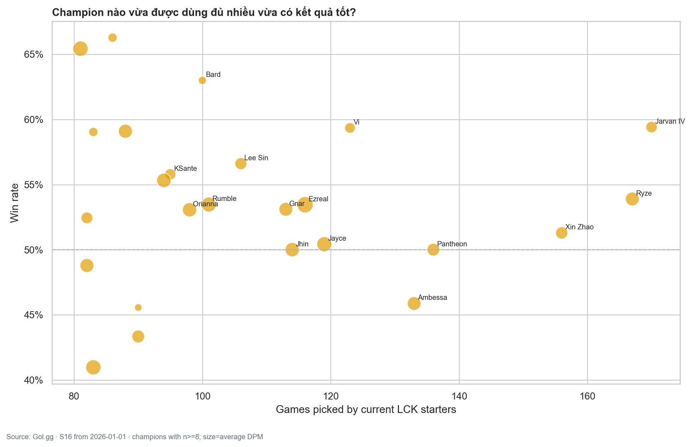
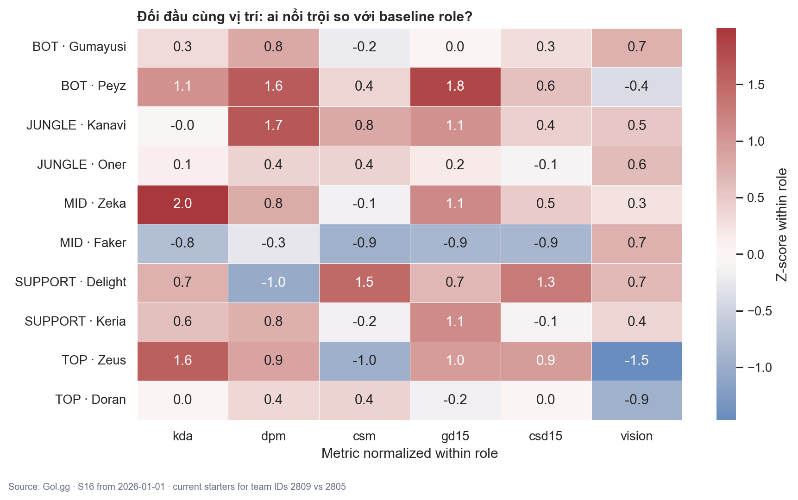

# LoL Pro Analytics S16

> Pipeline Data Analytics/Data Science bằng Python cho 10 đội LCK cấp một và đội hình chính trong Season 16: thu thập dữ liệu web, kiểm định chất lượng, phân tích đội/tuyển thủ, trực quan hóa và dự đoán matchup có giải thích.

[](https://www.python.org/)
[](configs/project.json)
[](tests/test_foundation.py)
[](reports/data-quality-phase-4.md)

## 1. Project giải quyết vấn đề gì?

Thông tin esports thường nằm rải rác ở lịch thi đấu, trang đội, trang game và bảng full stats. Project này biến các trang đó thành một quy trình phân tích có thể chạy lại hằng ngày và truy ngược được nguồn.

Sản phẩm hỗ trợ bốn kiểu câu hỏi độc lập, không ép người dùng phải luôn nhập hai đội:

| Chế độ | Câu hỏi điển hình | Đầu ra chính |
|---|---|---|
| Một đội | Phong độ, side, economy, objectives và champion pool ra sao? | KPI, recent games, rolling form, bảng/biểu đồ |
| Hai đội | T1 và HLE khác nhau ở feature nào, H2H và từng role ra sao? | H2H detail, dumbbell, role heatmap, matchup analysis |
| Một tuyển thủ | KDA, DPM, CSM, lane differential và tướng thường dùng thế nào? | Player profile, champion pool, sample warning |
| Hai tuyển thủ | Hai người cùng/khác đội khác nhau ở đâu? | Bảng so sánh; cảnh báo nếu khác role |
| Matchup | Khả năng thắng và các kịch bản trận tiếp theo là gì? | Probability, uncertainty, evidence, official/hypothetical status |

Đây là đồ án học thuật DA/DS, không phải công cụ cá cược. Prediction là baseline minh bạch, luôn đi cùng sample size, cutoff, độ mới dữ liệu và giới hạn diễn giải.

## 2. Phạm vi dữ liệu được khóa

| Thành phần | Quy tắc |
|---|---|
| Mùa giải | Chỉ S16, từ `2026-01-01`; không trộn S15 |
| Đội | 10 đội LCK cấp một; loại Academy/Challengers |
| Tuyển thủ | Starting five gần nhất của mỗi đội; không lập hồ sơ chính cho dự bị |
| Giải đấu | LCK và giải quốc tế S16 mà đội LCK tham dự |
| Nguồn thống kê chính | [Gol.gg](https://gol.gg/esports/home/) |
| Nguồn lịch bổ sung | Leaguepedia MediaWiki; LoL Esports là fallback |
| Lưu trữ | Raw archive cục bộ + SQLite chuẩn hóa |

Đối thủ quốc tế được giữ như dimension phụ khi cần lịch sử đối đầu, nhưng không trở thành đội LCK primary.

## 3. Workflow từ yêu cầu đến sản phẩm



Bản tương tác, có theme, semantic search và guided views: [`docs/diagrams/lol-analytics-pipeline.html`](docs/diagrams/lol-analytics-pipeline.html). Source có thể chỉnh sửa: [`docs/diagrams/lol-analytics-pipeline.dataflow.json`](docs/diagrams/lol-analytics-pipeline.dataflow.json).

## 4. Những phần DA/DS được thể hiện

| Lớp nghiệp vụ | Kỹ thuật dùng thật | Bằng chứng |
|---|---|---|
| Data acquisition | Requests, BeautifulSoup, retry, cache, rate limiting, raw archive | `src/collection/` |
| Data engineering nhỏ gọn | SQLite, dimension/fact schema, idempotent upsert | `src/storage/` |
| Data quality | Normalize text/role, missingness, duplicate, range, lineup, draft/scope gates | `src/quality/`, 12/12 checks |
| EDA | Shape/dtype, descriptive stats, skew/kurtosis, IQR review, groupby, crosstab, correlation | `src/analysis/pandas_eda.py` |
| Analysis | Recent form, side split, H2H, champion pool, same-role matchup | `src/analysis/metrics.py` |
| Statistics | Wilson CI, two-proportion z-test, Welch t-test, Cohen's d; assumptions | `src/analysis/statistics.py` |
| Visualization | Heatmap, lollipop, bubble scatter, box, violin, stacked bar, small multiples, dumbbell | `reports/figures/` |
| Data Science | Bayesian smoothing, explainable baseline, Logistic Regression, walk-forward validation | `src/modeling/` |
| Delivery | CLI, VS Code notebook, Streamlit dashboard, Markdown/JSON/CSV reports | `src/cli.py`, `notebooks/`, `app/` |

### Snapshot được kiểm chứng ngày 08/09/2026

| Chỉ báo | Kết quả |
|---|---:|
| Game pages trong SQLite cục bộ | 667 |
| Primary LCK team-game rows dùng cho visualization | 1.248 |
| Current-starter player-game rows | 5.397 |
| Draft actions | 13.340 = 20/game |
| Objective timeline milestones | 5.793 trên 666/667 game |
| Automated tests | 31/31 passed |
| Data-quality gates | 12/12 passed |
| Rich visualization | 14 PNG + 6 notebook figures |
| Baseline backtest | 581 games; accuracy 59,55%; Brier 0,2375; log loss 0,6679 |
| Logistic Regression comparison | 577 games; accuracy 60,14%; Brier 0,2399; log loss 0,6764 |

Accuracy của Logistic Regression nhỉnh hơn baseline nhưng Brier/log loss kém hơn; vì vậy project không tuyên bố mô hình phức tạp hơn chắc chắn tốt hơn. Xem bằng chứng đầy đủ tại [`reports/backtest-phase-9.md`](reports/backtest-phase-9.md).

## 5. Visualization gallery

Các hình được chọn theo câu hỏi nghiệp vụ, không chỉ để “show chart”. Toàn bộ figure và metadata nằm ở [`reports/figures/`](reports/figures/) và [`reports/visualization-phase-8.json`](reports/visualization-phase-8.json).

| So sánh team profile | Phong độ theo thứ tự trận |
|---|---|
|  |  |

| Champion usage × win rate × DPM | T1–HLE same-role matchup |
|---|---|
|  |  |

Quy tắc đọc hình: tỷ lệ luôn đi cùng mẫu; clipping chỉ dùng cho display; correlation không phải causation; champion win rate mẫu nhỏ không dùng để xếp hạng chắc chắn.

## 6. Quick start trên VS Code

### Yêu cầu

- Windows CPython 3.12 x64 từ python.org.
- VS Code với Python và Jupyter extensions.
- Mở đúng thư mục root của repository.

### Cài môi trường

```powershell
.\scripts\setup_vscode.ps1
.\.venv-vscode\Scripts\python.exe scripts\verify_environment.py
```

Kết quả verifier cần có `"status": "ready"` và `"missing": []`.

### Kiểm tra code ngay sau khi clone

Các unit test dùng fixture cục bộ, không cần database production hay internet:

```powershell
.\.venv-vscode\Scripts\python.exe -m unittest discover -s tests -v
```

### Tạo snapshot dữ liệu lần đầu

Database/raw data là runtime artifact nên không được commit. Chạy:

```powershell
.\.venv-vscode\Scripts\python.exe -m src.cli db-init
.\.venv-vscode\Scripts\python.exe -m src.cli update-all --dry-run --max-games-per-team 1
.\scripts\daily_update.ps1 -MaxGamesPerTeam 5
```

`daily_update.ps1` chạy tuần tự collect → quality → EDA → statistics → visualization → backtest → schedule → freshness → final report và dừng nếu bước bắt buộc lỗi.

### Mở dashboard

```powershell
.\.venv-vscode\Scripts\python.exe -m streamlit run app\streamlit_app.py
```

Hoặc `Ctrl+Shift+P` → **Tasks: Run Task** → **App: Run Streamlit dashboard**.

## 7. Cheatsheet lệnh thường dùng

| Mục tiêu | Lệnh |
|---|---|
| Kiểm tra cấu hình | `python -m src.cli health` |
| Kiểm tra độ mới | `python -m src.cli freshness` |
| Xem trước phạm vi crawl | `python -m src.cli update-all --dry-run --max-games-per-team 1` |
| Cập nhật 10 đội + fullstats | `python -m src.cli update-all --max-games-per-team 5 --include-fullstats` |
| Chạy 12 quality gates | `python -m src.cli quality-check` |
| EDA Pandas/NumPy | `python -m src.cli pandas-eda` |
| Tạo 14 hình T1–HLE | `python -m src.cli visualize --team-a-id 2809 --team-b-id 2805` |
| Phân tích một đội | `python -m src.cli team-report --team-id 2809` |
| Phân tích một tuyển thủ | `python -m src.cli player-report --player-id 1328` |
| So sánh hai tuyển thủ | `python -m src.cli player-compare --player-a-id 1328 --player-b-id 5204` |
| H2H + role matchup | `python -m src.cli h2h-report --team-a-id 2809 --team-b-id 2805` |
| Dự đoán matchup | `python -m src.cli predict-matchup --team-a-id 2805 --team-b-id 2809` |
| Walk-forward backtest | `python -m src.cli backtest` |
| Demo offline | `.\scripts\demo_offline.ps1 -TeamAId 2809 -TeamBId 2805` |

Trong bảng trên, `python` nghĩa là `.\.venv-vscode\Scripts\python.exe` khi chạy trên Windows.

## 8. Đọc và học project theo thứ tự nào?

| Bước | Tài liệu | Bạn sẽ hiểu gì? |
|---:|---|---|
| 1 | [`docs/01_PROJECT_OVERVIEW.md`](docs/01_PROJECT_OVERVIEW.md) | Bài toán, scope, pipeline, deliverables |
| 2 | [`docs/03_DA_DS_PLAYBOOK.md`](docs/03_DA_DS_PLAYBOOK.md) | Tư duy DA/DS, framework, metrics và thống kê nền |
| 3 | [`docs/02_VSCODE_HANDS_ON_GUIDE.md`](docs/02_VSCODE_HANDS_ON_GUIDE.md) | Cầm tay chỉ việc setup, chạy, demo, debug |
| 4 | [`docs/05_CODEBASE_FILE_GUIDE.md`](docs/05_CODEBASE_FILE_GUIDE.md) | Bản chất và hợp đồng input/output của từng file |
| 5 | [`notebooks/01_eda_s16.ipynb`](notebooks/01_eda_s16.ipynb) | Chạy từng cell như Colab trong VS Code |
| 6 | [`docs/04_REFERENCE_ALIGNMENT.md`](docs/04_REFERENCE_ALIGNMENT.md) | Project bám các nguồn tham khảo ở đâu và không vượt scope thế nào |
| 7 | [`ROADMAP.md`](ROADMAP.md) | Mười phase triển khai và tiêu chí hoàn thành |

Đặc tả bổ sung: [`PRODUCT_SPEC`](docs/PRODUCT_SPEC.md) · [`DATA_SCHEMA`](docs/DATA_SCHEMA.md) · [`QUALITY_GATE`](docs/QUALITY_GATE.md) · [`RUNBOOK`](docs/RUNBOOK.md) · [`REQUIREMENTS_TRACEABILITY`](docs/REQUIREMENTS_TRACEABILITY.md).

## 9. Cấu trúc repository

```text
lol-pro-analytics-s16/
├── app/                 # Streamlit dashboard (6 analysis modes)
├── configs/             # S16, source, team and freshness contract
├── data/                # Local-only raw/processed/SQLite runtime artifacts
├── docs/                # Overview, VS Code guide, playbook, schema, file guide
├── notebooks/           # 19 Markdown + 19 code cells for EDA/visualization
├── reports/             # QA, EDA, statistics, backtest, figures and final handoff
├── scripts/             # Setup, daily update, offline demo, notebook sync
├── src/
│   ├── collection/      # Web acquisition and parsers
│   ├── storage/         # SQLite schema and idempotent persistence
│   ├── quality/         # Cleaning and 12 integrity gates
│   ├── analysis/        # Metrics, EDA, statistics and visualization
│   ├── modeling/        # Explainable prediction and walk-forward backtest
│   └── reporting/       # Final handoff report
└── tests/               # 31 tests + offline HTML/JSON fixtures
```

## 10. Reproducibility, trách nhiệm và giới hạn

- Mọi report quan trọng ghi `run_at`, data cutoff, source và sample size.
- Raw HTML, SQLite và processed CSV được sinh cục bộ, không commit lên Git vì thay đổi hằng ngày và có thể lớn.
- Các PNG trong `reports/figures/` là snapshot minh họa đã được sinh từ dữ liệu ngày kiểm chứng; chạy lại pipeline sẽ cập nhật chúng.
- Gol.gg có thể thay đổi HTML; source audit và parser fixtures giúp phát hiện nhưng không loại bỏ hoàn toàn rủi ro.
- Lịch bracket có tên đội TBD; prediction chỉ mang nhãn official khi fixture tương lai cụ thể đã được xác nhận.
- Missing giữ là `NULL`; project không tự điền 0 để tạo cảm giác dữ liệu đầy đủ.
- Model chưa phải production forecasting system; cần theo dõi calibration, drift và thay đổi meta/patch trước khi dùng cho quyết định thực tế.

Báo cáo trạng thái phát hành mới nhất: [`reports/release-readiness-2026-09-08.md`](reports/release-readiness-2026-09-08.md).
